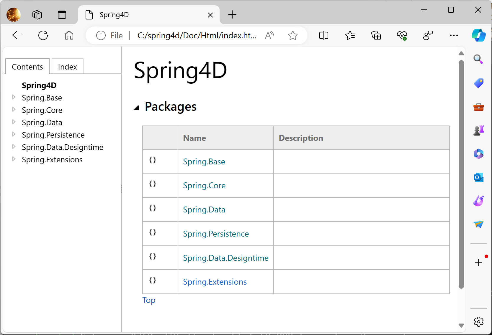
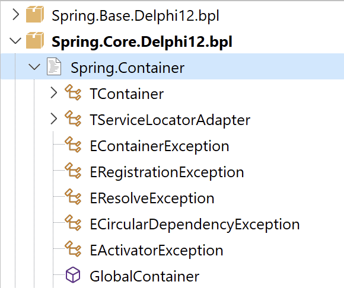
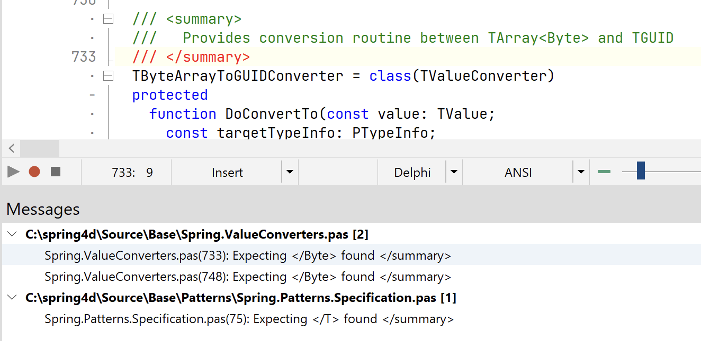
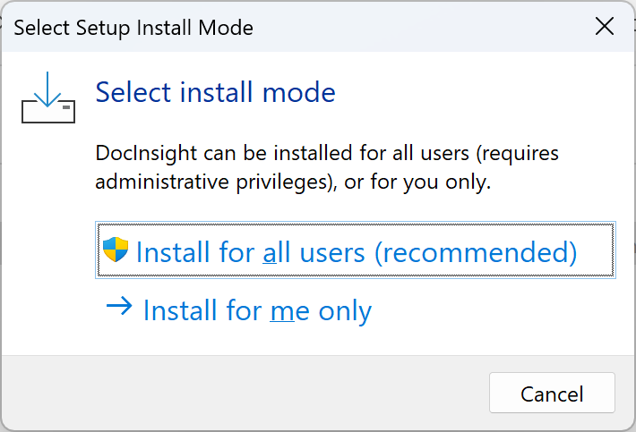

# Announcing DocInsight 2024 (Draft)

[DocInsight](https://devjetsoftware.com/products/documentation-insight/), also known as _Documentation Insight_, is an API documentation tool for Delphi developers.

The first release of _DocInsight 2024_ represents a major update, introducing support for **Delphi 12** and a completely redesigned **DocInsight CLI**. This version addresses many long-standing issues from previous versions and provides valuable enhancements.

## Delphi 12

### IDE Insight

## DocInsight CLI

- Progress
- Parallel jobs
- Ctrl+C handler
- Error-handing

### `build` command

### `check` command

## Documentation

### Browsing local HTML output

You no longer need to use a web server to browse the HTML output.

### CHM font on HighDPI

The font was too small on HighDPI displays. It has been fixed now.

### Package list

### Preserve enum order

Enumeration members are now sorted in declaration order, rather than by alphabetical order.

### Misc. changes

- Change the term "Namespace" to "Unit"
- Strip method parameters from topic title
- Improve word wrapping of topic title

## Editor

### Insert image with relative path

## Documentation Inspector

### Use compact layout to display more content

### Add _View_ menu item in context popup menu

- Toolbar
- Tabs
- Dockable
- Stay on Top

### Handles large files more efficiently

## Documentation Explorer

### Auto navigate to active file when open

### New structure view icons

### Document included units in a package

## Check Documentation

### Show source location while checking

## Format Documentation

### Convert `src` attribute of `` tag to relative path

### Force text wrap after ` ` tag

### Bug fixes

- Missing space in adjacent inline tags
- Offset-by-one bug in text wrapping
- Unexpected wrap on punctuation
- Unexpected wrap in inline tags, e.g., `<see>`

## Installer

- Select install mode (all users/current user)

## Notable Fixes

- AV when opening a new empty project
- AV when running IDE with `-r` switch
- DocInsight.exe raises an Out of Memory error
- Failed to locate `transform.data`

## Known Issues

The following features are not included in this release. Please provide us with feedback if you require these features.

- _HelpAndManual_ output
- MSHELP2 output
- External XML documentation files
- Surround XML doc comment with a customizable region

## Licensing Options and Special Offer

With the release of DocInsight 2024, we are pleased to introduce a revamped licensing model:

- Commercial license

Licenses are purchased by the company and can be assigned to any single developer within the organization.

- Personal license

Tailored for individual use, this license is intended for those who purchase it with their own funds and should not be financed by companies in any form.

Customers with active Documentation Insight subscriptions since September 1, 2023, are eligible for a free six-month extension. Additionally, existing Documentation Insight customers can switch their subscriptions to a DocInsight subscription at the standard renewal price before June 10, 2024. For more details, please refer to our separate announcement.
