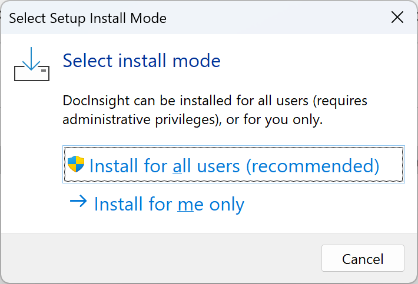

# Installation

To install DocInsight, download the latest version from the [Releases](../../releases/README.md), run the installer, and follow the instructions to complete the installation process.

## System Requirements

- Windows 10/11 (x86-64/arm64)
- Delphi XE7 or higher

## Installation Mode

### For Current User

By default, DocInsight is installed in the following directory:
`%LocalAppData%\Programs\DevJet\DocInsight\6.0`.

### For All Users (Requires Admin privileges)

If you install DocInsight for all users, the default installation directory is:
`%ProgramFiles(x86)%\DevJet\DocInsight\6.0`.

## Silent Installation

You can use the `/silent` or `/verysilent` option to install DocInsight silently. For more information, please see the [Setup Command Line Parameters](https://jrsoftware.org/ishelp/topic_setupcmdline.htm) in the [Inno Setup](https://jrsoftware.org/isinfo.php) documentation.

## Alternative Root Registry

If you use the `bds.exe -r` command line switch to start Delphi with an alternative root registry, you may need to manually add the DocInsight extension to the registry.

### Example

Take Delphi 12 for instance, if you have launched Delphi with `bds.exe -rTest`, you need to add the following entry:

`HKEY_CURRENT_USER\Software\Embarcadero\Test\23.0\Experts`
- Name: `DocInsight`
- Value Type: String Value (`REG_SZ`)
- Value: `%LocalAppData%\Programs\DevJet\DocInsight\6.0\DocInsight290.dll` (Use the actual path on your machine)

### Extension Compatibility

See [Extension Compatibility](../reference/extension-compatibility.md) for a list of DocInsight DLLs and the corresponding Delphi versions.