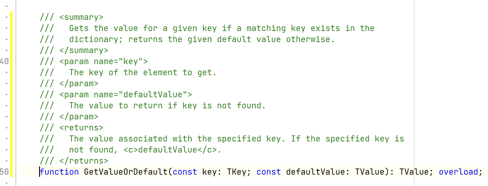
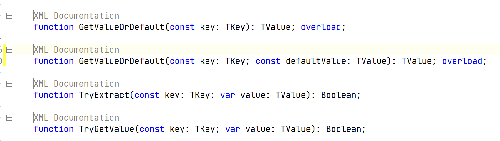

# Quick Start Guide

You will see the **DocInsight** menu in the Delphi IDE after installing the extension. This menu provides access to the main features of DocInsight.

## Document Source Code

1. Open a Delphi project.
2. Open a Delphi source file and move the cursor to the class or method you want to document.
3. Click `DocInsight > Documentation Inspector`.
4. Use the **WYSIWYG** doc editor to document the code element.
   
5. The doc editor will produce an XML documentation comment above the declaration of the code element.
   

## Fold/Unfold Documentation

You can fold XML doc comments via `DocInsight > Fold Documentation`.

## Documentation Explorer

View the documentation of your project in the Documentation Explorer. Click `DocInsight > Documentation Explorer` to open the explorer.

## Build Documentation

Click `DocInsight > Build Documentation` to build documentation for your project. It will use a wizard to guide you through the process.

## Documentation Output

The Documentation wizard will use the DocInsight CLI to build documentation for the source projects. You can preview the output when it is completed.

- HTML output

  

- CHM output

  

## Deploy Documentation

You can deploy the generated HTML or CHM documentation files to a web server or share them with your team members.