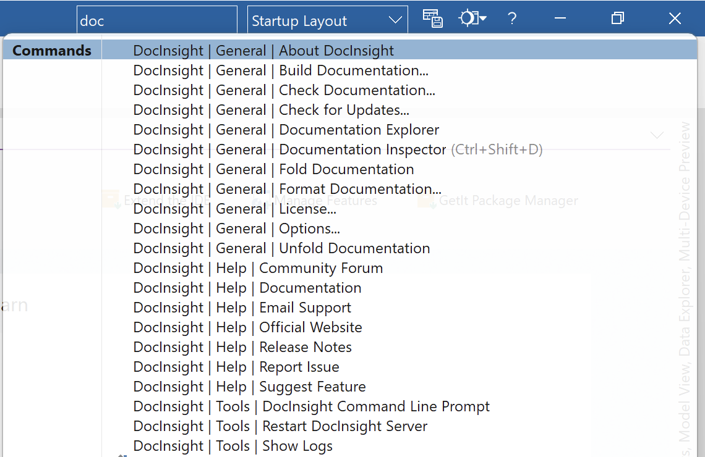
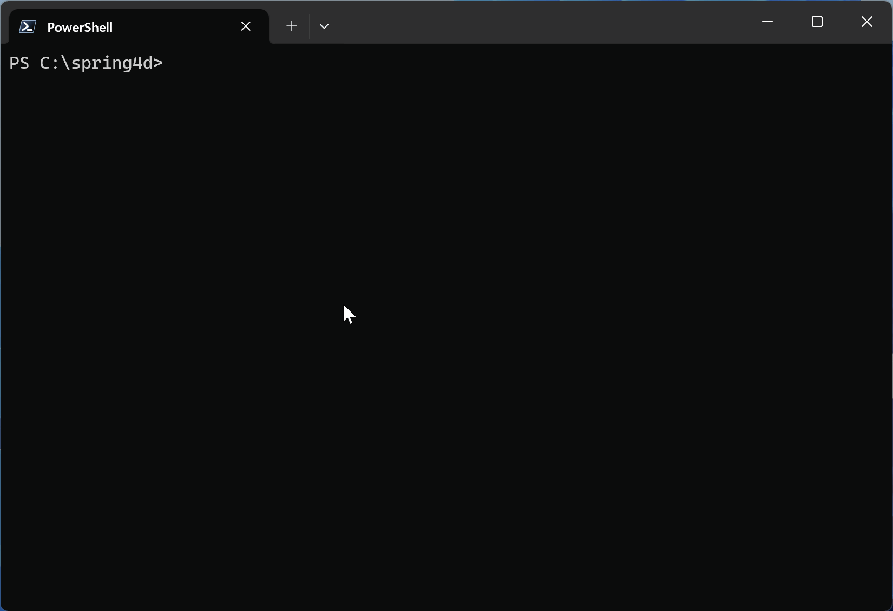
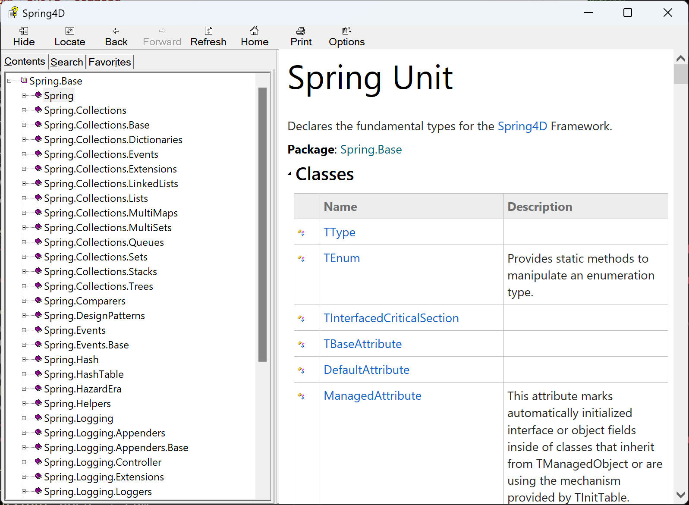
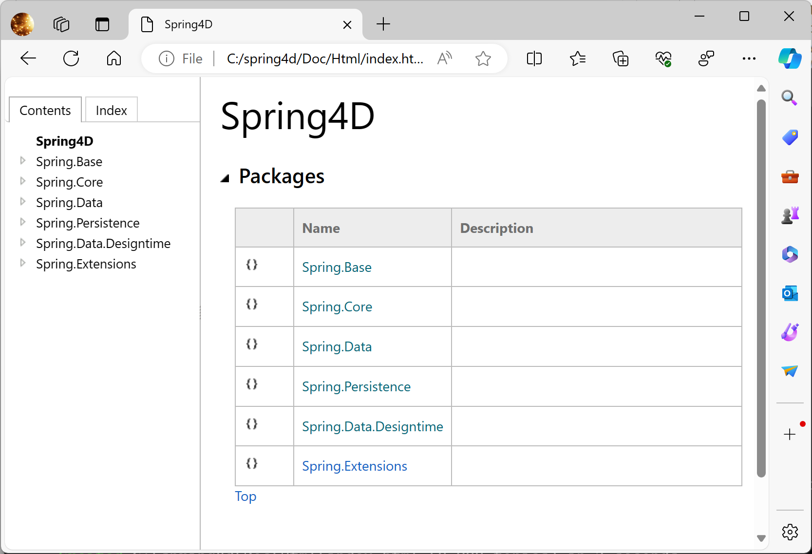
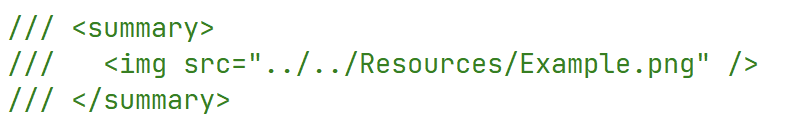
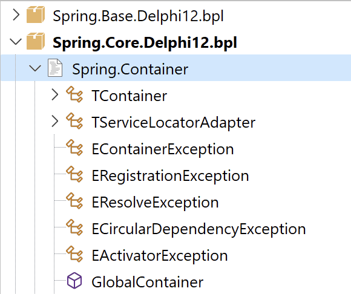
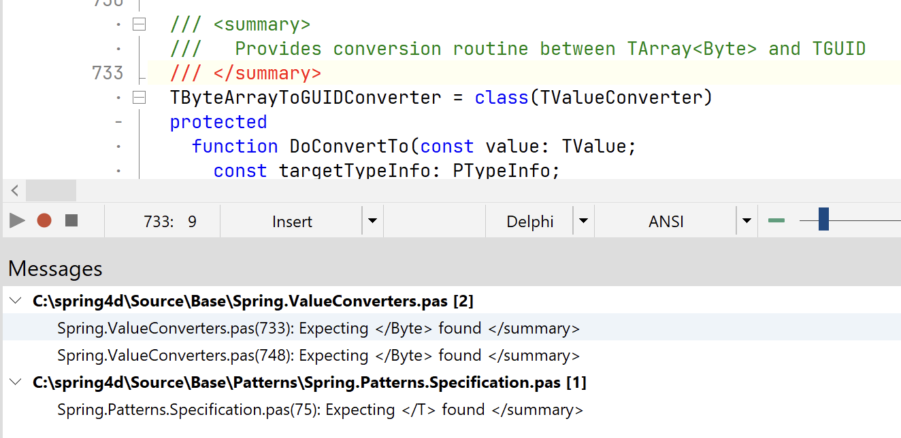

# DocInsight 2025 Release Notes (Draft)

[DocInsight](https://devjetsoftware.com/products/documentation-insight/), also known as _Documentation Insight_, is an API documentation tool for Delphi developers.

The first release of _DocInsight 2025_ represents a major update, introducing support for Delphi XE7 to **Delphi 12** and a completely redesigned **DocInsight CLI**. This version addresses many long-standing issues from previous versions and provides valuable enhancements.

## Delphi 12

_DocInsight 2025_ now fully supports Delphi 12, accommodating its new features and improvements, which enhance the tool's functionality and the developer's experience.

### Integration with IDE Insight

Provides quick access to DocInsight actions.

## DocInsight CLI

The CLI of DocInsight has been completely redesigned to provide a more intuitive, efficient, and robust tool for managing project documentation from the command line. Here are the key improvements:

- **Progress Reporting**: Enhanced progress feedback provides real-time updates on documentation generation, allowing for better process monitoring and management.
- **Parallel Jobs**: Utilizing the full power of modern multi-core processors, the CLI now supports specifying the number of parallel jobs, significantly speeding up documentation generation.
- **Ctrl+C Handler**: Improved interruption handling ensures that the CLI can safely terminate processes, preventing data corruption and allowing for a clean shutdown in any situation.
- **Error Handling**: The new error-handling provides clearer, more descriptive error messages, making it easier to diagnose and resolve issues during the documentation process.

### `build` command

### `check` command

## Documentation

### Browsing local HTML output

You no longer need to use a web server to browse the HTML output.

### CHM font on HighDPI

The font was too small on HighDPI displays. It has been fixed now.

### Package list

### Preserve enum order

Enumeration members are now sorted in declaration order, rather than by alphabetical order.

### Misc. changes

- Change the term "Namespace" to "Unit"
- Strip method parameters from topic title
- Improve word wrapping of topic title

## Editor

### Insert image with relative path

## Documentation Inspector

### Use compact layout to display more content

### Add _View_ menu item in context popup menu

- Toolbar
- Tabs
- Dockable
- Stay on Top

### Handles large files more efficiently

## Documentation Explorer

### Auto navigate to active file when open

### New structure view icons

### Document included units in a package

## Check Documentation

### Show source location while checking

## Format Documentation

### Convert `src` attribute of `` tag to relative path

### Force text wrap after ` ` tag

### Bug fixes

- Missing space in adjacent inline tags
- Offset-by-one bug in text wrapping
- Unexpected wrap on punctuation
- Unexpected wrap in inline tags, e.g., `<see>`
- Inconsistent indent in `<code>` element

## Installer

- Provide a unified installer for all supported Delphi versions
- Select installation mode (all users/current user)
- Group extensions and automatically select for installed Delphi IDEs
- Install only the selected extensions for Delphi
- Uninstall previous versions

## Notable Fixes

- AV when opening a new empty project
- AV when running IDE with `-r` switch
- DocInsight.exe raises an Out of Memory error
- Failed to locate `transform.data`
- DocExplorer lost focus when clicking on a new file

## Known Issues

The following features are not included in this release. Please provide us with feedback if you require these features.

- _HelpAndManual_ output
- MSHELP2 output
- External XML documentation files
- Surround XML doc comment with a customizable region

## Licensing Options and Special Offer

With the release of DocInsight 2025, we are pleased to introduce a revamped licensing model:

- Commercial license
- Personal license

For more information, please refer to our separate announcement.
